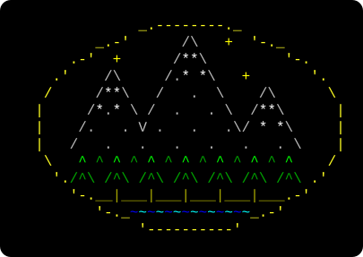

  

# Saturn Link : Midgaard

A MUD client for the Sega Saturn and Dreamcast, for the <a href='https://github.com/bozimmerman/CoffeeMud'>CoffeeMUD</a> server at <a href='https://suin.uk'>suin.uk</a>.

## Table of Contents
1. [Overview](#Overview)
1. [About the World](#About-the-World)
1. [Setup Instructions](#Setup-Instructions)
1. [Controls](#Controls)
1. [Playing Online](#Playing-Online)
1. [Helpful Game Tips](#Helpful-Game-Tips)
1. [Credits & Special Thanks](#Credits)
1. [Reporting Issues](#Reporting-Issues)
1. [Release Changelog](#Release-Changelog)

## **Overview**

The year is 1990. A group of students at the University of Copenhagen write DikuMUD, and with it a little city called Midgaard.

Most of the fantasy MUDs that came after descend from it, and a lot of them kept Midgaard as their starting city. If you ever played a MUD, there's a good chance you started there...

## 
...And now it's on the Saturn and the Dreamcast. Saturn Link is a terminal for the NetLink, the Dreamcast modem and the Broadband Adapter, built for one server: CoffeeMUD at suin.uk, with Midgaard at its centre. The same world is also playable in any regular browser at [http://suin.uk/mud](https://suin.uk/mud).

What's here:

- A Saturn disc, a Dreamcast disc, and a netbin you launch from [http://suin.uk/mud](https://suin.uk/mud)
- MSP sound effects on both discs
- ANSI colour, 256 lines of scrollback and 8 lines of command history
- 240p and 480p on the Dreamcast, 78 or 80 columns on the Saturn
- NAWS, password masking, and redial after a dropped line

## **About the World**

<table>
  <tr>
    <td><strong>Engine</strong></td>
    <td>CoffeeMUD (Bo Zimmerman)</td>
  </tr>
  <tr>
    <td><strong>Starting City</strong></td>
    <td>Midgaard, from DikuMUD (1990)</td>
  </tr>
  <tr>
    <td><strong>Areas</strong></td>
    <td>48 native, 45 from CircleMUD, 4 from SMAUG</td>
  </tr>
  <tr>
    <td><strong>Races / Classes</strong></td>
    <td>25 races, 6 starting classes, about 40 specialists</td>
  </tr>
 </table>

Dynamic weather, naval combat, crafting, gathering and detailed character customization. The [Saturn Link guides](https://suin.uk/mud/guides/) and the [player's handbook](https://suin.uk/mud/guides/handbook.html) cover the rest.

## **Setup Instructions**

Download <kbd>Saturn Link Midgaard (USA) &lt;version&gt;.zip</kbd> from [Releases](https://github.com/suinevere/saturn-link-midgaard-releases/releases) and unzip it. It holds both discs and the netbin.

### Sega Saturn ###

1. Burn the `.cue`/`.bin`, or load it on an optical drive emulator

### Sega Dreamcast ###

1. Burn the `.cdi`, or load it on an optical drive emulator

### No disc ###

In the Saturn's PlanetWeb 4.0 browser, go to [http://suin.uk/mud](https://suin.uk/mud). Same game, no sound effects.

**--> Important! <--**
- Every version needs a keyboard. There's no pad support.
- Mednafen has no NetLink emulation, so it can't connect.

## **Controls**

### Keyboard ###

<table>
  <tr><td><strong>Enter</strong></td><td>Send the line</td></tr>
  <tr><td><strong>Left / Right / Home / End</strong></td><td>Move in the line</td></tr>
  <tr><td><strong>Backspace / Delete</strong></td><td>Edit the line</td></tr>
  <tr><td><strong>Up / Down</strong></td><td>Previous and next line sent</td></tr>
  <tr><td><strong>Ctrl + C</strong></td><td>Clear the line</td></tr>
  <tr><td><strong>Page Up / Page Down</strong></td><td>Scroll back and forward</td></tr>
  <tr><td><strong>Ctrl + Up / Down</strong></td><td>Scroll one line</td></tr>
  <tr><td><strong>Esc, twice within a second</strong></td><td>Hang up (once cancels dialling on the Saturn)</td></tr>
  <tr><td><strong>F4</strong></td><td>Mute or unmute sound, on the discs</td></tr>
  <tr><td><strong>F5 / F6 / F7</strong></td><td>Cycle the colour of the MUD's text / your text / the client's messages</td></tr>
  <tr><td><strong>F8</strong></td><td>Cycle the MUD's colours: ANSI, green, amber, white, cyan</td></tr>
  <tr><td><strong>F9</strong></td><td>Alignment ruler, for setting the picture on a TV</td></tr>
  <tr><td><strong>F10</strong></td><td>Saturn: 78 or 80 columns. Dreamcast: 480p or 240p</td></tr>
  <tr><td><strong>F11 / F12</strong></td><td>Saturn: move the picture left and right. Dreamcast: widen and narrow the top and bottom border</td></tr>
</table>

Any key skips the splash screen, and any key redials after a disconnect.

## **Playing Online**

- **Saturn:** a NetLink modem into a DreamPi. It dials `199409`, three tries.
- **Dreamcast:** a Broadband Adapter with an IP address set in the console, or a DreamPi on `555`.
- **Browser:** PlanetWeb 4.0 at [http://suin.uk/mud](https://suin.uk/mud), or any PC or phone browser at the same address.

## **Helpful Game Tips**

- Type `SOUNDS` once in game to have the server send sound effects. **F4** mutes them.
- **F9**, then **F11** / **F12**, lines the picture up on a TV that crops the edges.
- The netbin sits on **RELEASING THE LINE** for about 15 seconds when it starts. That's normal.

## **Credits**

**Special Thanks**
- Bo Zimmerman and contributors, for CoffeeMUD (Apache License 2.0)
- The DikuMUD authors at the University of Copenhagen, and the CircleMUD and SMAUG area builders
- CoffeeMUD's MSP sound pack, `sounds.zip`
- ReyeMe and contributors, for SaturnRingLib
- KallistiOS, for the Dreamcast SDK and the 8x16 "Naomi" font used at 480p
- Daniel Hepper, for font8x8, used at 240p

MIT, for the client. The SDKs, SGL and the compilers keep their own licences, and a built Saturn disc contains SGL code.

## **Reporting Issues**

If you find an issue, be it a crash, a freeze or a dropped connection, please [submit a new issue here](https://github.com/suinevere/saturn-link-midgaard-releases/issues/new).

## **Release Changelog**

- **Version 0.1.0 (9/29/2026)**
  - Initial release
